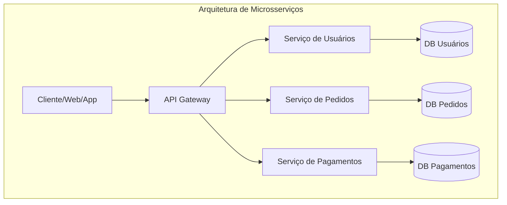

# Aula 01 - Introdução a Serviços e Microsserviços 🌐

!!! tip "Objetivo"
    **Objetivo**: Compreender a evolução das arquiteturas de software, diferenciar Monólitos de Microsserviços e entender o papel das APIs no ecossistema moderno de desenvolvimento.

---

## 1. O que são Serviços e Microsserviços? 🧩

No desenvolvimento moderno, um **serviço** é uma unidade funcional que entrega um valor específico (ex: processar um pagamento, enviar um e-mail). 

### 🏛️ O Monólito
Historicamente, sistemas eram construídos como **Monólitos**: um único bloco de código onde tudo (interface, lógica, banco de dados) está fortemente acoplado.

*   **Vantagens**: Simples de desenvolver inicialmente, fácil de testar localmente.
*   **Desvantagens**: Difícil de escalar, uma falha em um módulo pode derrubar o sistema todo, barreira tecnológica (difícil mudar a linguagem após o início).

### 🏗️ Os Microsserviços
A arquitetura de **Microsserviços** decompõe a aplicação em serviços pequenos, independentes e focados em uma única responsabilidade (Single Responsibility Principle).

*   **Vantagens**: Escalabilidade granular, resiliência (isolamento de falhas), liberdade tecnológica (cada serviço pode usar uma linguagem diferente).
*   **Desvantagens**: Complexidade operacional, dificuldade em manter a consistência de dados, latência de rede.

---

## 2. Comparativo: Monólito vs Microsserviços ⚖️

| Característica | 🏛️ Monólito | 🏗️ Microsserviços |
| :--- | :--- | :--- |
| **Escalabilidade** | Vertical (Aumenta servidor) | Horizontal (Mais instâncias do serviço) |
| **Deploy** | Tudo ou nada | Independente por serviço |
| **Falhas** | Propagam-se facilmente | Isoladas ao serviço |
| **Tecnologia** | Única (Stack fixa) | Poliglota (Mix de linguagens) |
| **Complexidade** | Baixa no início, alta no final | Alta desde o início |

### Visualização de Arquitetura (Mermaid)



---

## 3. A Economia das APIs 📡

API (**Application Programming Interface**) é a "ponte" que permite a comunicação entre esses serviços ou entre sistemas diferentes.

*   **REST**: O padrão de mercado baseado no protocolo HTTP.
*   **Endpoints**: URLs específicas que expõem funcionalidades (ex: `GET /produtos`).
*   **Contratos**: Acordos sobre como os dados devem ser enviados e recebidos (geralmente via JSON).

---

## 4. Ferramentas Essenciais 🛠️

Para trabalhar com backend e APIs, você precisará de um "cinto de utilidades" moderno:

1.  **Client HTTP (Postman/Insomnia)**: Para testar endpoints sem precisar de um frontend.
2.  **Docker**: Para "empacotar" seus serviços e garantir que rodem em qualquer máquina.
3.  **Git/GitHub**: Para versionamento e colaboração.
4.  **Runtime**: Node.js, Java (JDK) ou Python (dependendo do projeto).

---

## 5. Estrutura de um Projeto Moderno 📂

Diferente de um app mobile, um ecossistema de microsserviços geralmente é organizado em **Mono-repos** ou **Multi-repos**.

### Visão de Pastas (Padrão Backend)

```termynal
$ ls -R backend-master
auth-service/ (Nodejs)
├── src/
├── package.json
└── Dockerfile

catalog-service/ (Java/Spring)
├── src/
├── pom.xml
└── Dockerfile

api-gateway/ (Go)
└── main.go
```

---

## 6. Mini-Projeto: Configurando o Cinto de Utilidades 🚀

Sua missão é preparar o ambiente para o desenvolvimento backend:

1.  Instalar o **Visual Studio Code** (ou IntelliJ CE).
2.  Instalar o **Postman** ou a extensão **Thunder Client** no VS Code.
3.  Instalar o **Docker Desktop**.
4.  Garantir que o **Git** esteja configurado no seu terminal.

> Veja o passo a passo detalhado na seção [Configuração > Setup Backend](../setups/setup-01.md).

---

## 7. Exercício de Fixação 🧠

Responda em seu caderno/arquivo de notas:

1.  Explique o conceito de "Escalabilidade Horizontal" no contexto de microsserviços.
2.  Qual a função de um **API Gateway** em um sistema distribuído?
3.  Por que a consistência de dados é um desafio maior em microsserviços do que em monólitos?

---

**Próxima Aula**: Vamos mergulhar na [Arquitetura de Microsserviços e API Gateway](./aula-02.md)! 🏗️
