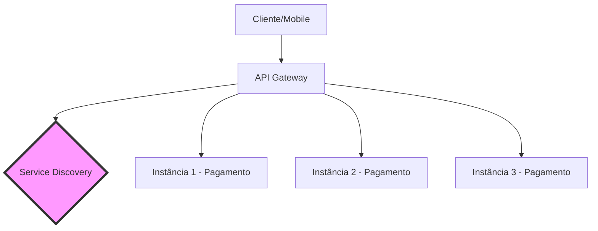

# Aula 02 - Arquitetura de Microsserviços e API Gateway 🏗️

!!! tip "Objetivo"
    **Objetivo**: Entender como múltiplos serviços independentes conversam entre si, o papel vital do API Gateway como porta de entrada e as estratégias de comunicação síncrona e assíncrona.

---

## 1. Comunicação entre Serviços 💬

Em um sistema distribuído, os serviços precisam trocar informações. Existem dois modelos principais:

### 🔄 Comunicação Síncrona (Sync)
O serviço chamador envia uma requisição e **espera** pela resposta imediata.
*   **Protocolo**: Geralmente HTTP/REST ou gRPC.
*   **Exemplo**: O serviço de Pedidos chama o serviço de Pagamentos e aguarda a confirmação para finalizar o carrinho.
*   **Pró**: Simples de entender e implementar.
*   **Contra**: Se o serviço destino estiver lento, todo o sistema fica lento (cascateamento).

### 📬 Comunicação Assíncrona (Async)
O serviço envia uma mensagem e **não espera** pela resposta. Ele continua seu trabalho.
*   **Protocolo**: Mensageria (RabbitMQ, Kafka, SQS).
*   **Exemplo**: O serviço de Pedidos envia um evento "Pedido Criado" para uma fila. O serviço de Logística lê essa fila quando puder.
*   **Pró**: Maior resiliência e desacoplamento.
*   **Contra**: Complexidade maior (consistência eventual).

---

## 2. O Papel do API Gateway 🚪

Em vez de expor todos os microsserviços diretamente para a internet, usamos um **API Gateway**. Ele atua como uma única porta de entrada para os clientes.

### Responsabilidades do Gateway:
1.  **Roteamento**: Encaminha a requisição para o serviço correto (ex: `/users` vai para `User-Service`).
2.  **Autenticação**: Verifica se o usuário está logado antes de passar a bola para os serviços internos.
3.  **Rate Limiting**: Impede que um cliente faça requisições demais e derrube o sistema.
4.  **Agregação**: Pode combinar dados de vários serviços em uma única resposta para o frontend.

---

## 3. Service Discovery e Load Balancing 🔍⚖️

Como o Gateway sabe o endereço de cada serviço se eles mudam de IP o tempo todo em containers?

### 🔎 Service Discovery
É uma agenda dinâmica (ex: Consul, Eureka) onde cada serviço se "registra" ao subir. O Gateway consulta essa agenda para achar o serviço.

### ⚖️ Load Balancing (Balanceamento de Carga)
Distribui as requisições entre várias instâncias do mesmo serviço para evitar sobrecarga.

---

## 4. Padrões de Resiliência: Circuit Breaker 🔌

Se um serviço está falhando, não adianta continuar mandando requisições para ele. O **Circuit Breaker** (Disjuntor) "abre o circuito" e retorna um erro imediato ou um dado em cache, evitando que o erro se espalhe.

---

## 5. Mini-Projeto: Simulando um Gateway 🚀

Vamos simular o comportamento de um Gateway usando o Postman:

1.  Crie uma Collection chamada "API Gateway Simulation".
2.  Configure variáveis de ambiente para `base_url`.
3.  Crie rotas que "apontam" para diferentes APIs públicas (ex: JSONPlaceholder para posts e ReqRes para usuários).
4.  Teste como se fosse um único sistema centralizado.

> Veja os detalhes práticos em [Exercícios > Ex 02](../exercicios/exercicio-02.md).

---

## 6. Exercício de Fixação 🧠

1.  Qual a diferença entre um API Gateway e um Load Balancer?
2.  Explique o problema do "Cascateamento de Falhas" em comunicações síncronas.
3.  Em que situação você usaria Kafka ao invés de HTTP para comunicar dois serviços?

---

**Próxima Aula**: Vamos colocar a mão na massa com a [Modelagem de APIs RESTful](./aula-03.md)! 📡
